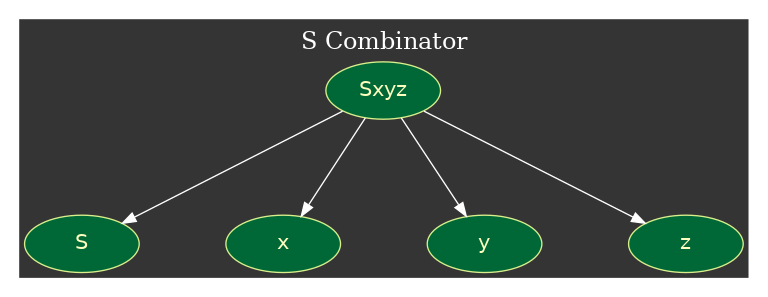
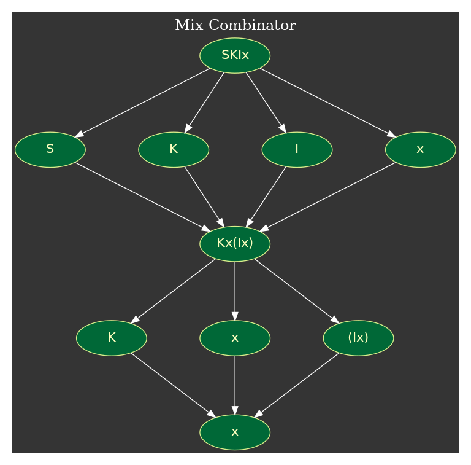

# colc (COmbinator Logic Calculator)
[](https://travis-ci.org/jiro4989/colc)

Combinator Logicをコマンドラインから使うためのツール

## コンビネータ論理(Combinator Logic)とは
引数に関数を受け取る関数(コンビネータ)のみで計算をするという考え方をコンビネータ
論理という。
チューリング完全であることが証明されているため、コンピュータで可能な計算は全てコ
ンビネータだけで計算が可能である。

以下にコンビネータ論理の主要な関数3つの例を示す。

### Sコンビネータ
Sコンビネータは3つのコンビネータを引数に取り、以下のように並び替える。  
※xyzはそれぞれ x y zという3つのコンビネータである。

```
Sxyz -> xz(yz)
```

以下の図のように、上記コンビネータはそれぞれ4つのコンビネータに分割され、3つの引
数を計算に利用する。



### Kコンビネータ
Kコンビネータは2つのコンビネータを引数に取り、1つ目のコンビネータを返す。

```
Kxy -> x
```

### Iコンビネータ
Iコンビネータは1つのコンビネータを引数に取り、1つ目のコンビネータを返す。

```
Ix -> x
```

### コンビネータの処理の流れ
コンビネータは計算不能になるまで計算結果を次の計算に利用する。
前述のSKIコンビネータによる連続した計算の例を以下に示す。



上記の計算の例では、最終的に x というコンビネータに到達した。
xというコンビネータは存在しないため、計算できずに計算を終了している。
よって、 SKIx というコンビネータの計算結果は x である

## colcコマンド
colcコマンドは上記のような一連の計算をコマンドライン(以下CLI)上で行えるようにし
たものである。

### インストール方法
[Go言語](https://golang.org/doc/install)をインストールし、以下のコマンドを実行する。

```bash
go get github.com/jiro4989/colc
```

または、このGitHubのReleaseページのバイナリをダウンロードする。

### 使い方

```bash
echo "Sxyz" | colc
# -> xz(yz)

colc clcode.txt

colc -f clcode1.txt -f clcode2.txt

# ファイル出力
colc clcode.txt -o out.txt

# JSON出力
colc clcode.txt -t json
colc clcode.txt -t json -o out.json
```

## 開発
### ヘルプ

```bash
make
```

### バイナリの生成

```bash
make build
```

### グラフ画像の生成

```bash
make graph
```
